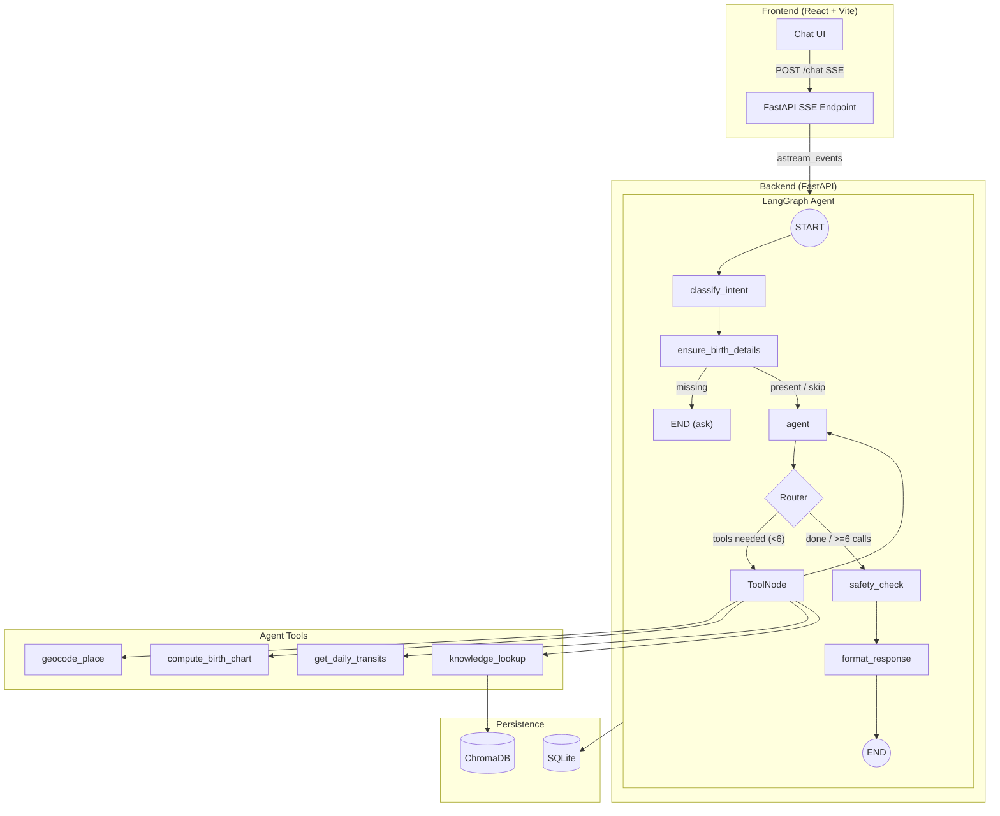

# AstroAgent — Aradhana 🌟

**AstroAgent** is a production-grade, agentic AI astrology companion named **Aradhana**. It computes real natal birth charts and daily transits using ephemeris data, performs RAG over curated astrological knowledge, and streams thoughtful, warm astrological guidance through a beautiful chat interface.

Built with LangGraph (agent orchestration), FastAPI (streaming API), ChromaDB (RAG), Groq (Llama-3.3-70b), SQLite (persistence) and React + TypeScript + Tailwind (frontend).

---

## Architecture



### Agent Flow

1. **classify_intent** — LLM classifies the user message as `chart`, `transit`, `question`, `greeting`, `chitchat`, `injection`, or `other`.
2. **ensure_birth_details** — If chart/transit intent and no birth data, asks user for details. Skips for casual/injection intents.
3. **agent** — Main ReAct reasoning node with Groq's Llama-3.3-70b-versatile. Handled injection natively via system prompt.
4. **tools** — Executes geocoding, chart computation, transit calculation, or knowledge RAG. (Max 6 calls per turn).
5. **safety_check** — Scans for certainty language, medical/financial/legal advice, and transit fearmongering; rewrites if needed.
6. **format_response** — Ensures Aradhana's warm, reflective tone and deduplicates "dear one".

---

## Setup Instructions

### Prerequisites
- Python 3.11+
- Node.js 18+
- Groq API key

### Backend

```bash
cd backend

# Create virtual environment
python3 -m venv venv && source venv/bin/activate

# Install dependencies
pip install -r requirements.txt

# Configure environment
cp .env.example .env
# Edit .env and add your GROQ_API_KEY and DATABASE_URL
# Example: DATABASE_URL=sqlite+aiosqlite:///./astroagent.db

# Initialize the RAG knowledge base (one-time)
python ingest.py

# Start the API server
uvicorn api.main:app --reload --port 8000
```

### Frontend

```bash
cd frontend

# Install dependencies
npm install

# Configure environment
cp .env.example .env
# Default values should work for local development

# Start the dev server
npm run dev
```

The frontend will be available at `http://localhost:5173` and will connect to the backend at `http://localhost:8000`.

---

## Evaluation Harness

```bash
cd backend
python -m eval.runner
```

This runs 26 test cases across 7 categories:
- **chart_request** — natal chart interpretation
- **transit_request** — daily energy / transits
- **knowledge_question** — general astrology queries
- **invalid_input** — error handling
- **safety** — medical/financial/legal guardrails
- **off_topic** — graceful redirection
- **adversarial** — prompt injection resistance

Results are printed as a scorecard summary and the detailed item-by-item results are saved to `eval/results/latest.csv` along with a timestamped CSV. The scorecard tracks pass rates, LLM-as-judge scores, latencies, and estimated cost.

See [EVALUATION.md](./EVALUATION.md) for full methodology.

---

## Project Structure

```
astroagent/
├── backend/
│   ├── agent/          # LangGraph graph, nodes, router, tools
│   ├── api/            # FastAPI app, routes, schemas
│   ├── data/           # Astrology knowledge files for RAG
│   ├── eval/           # Golden set, runner, scorecard
│   ├── tests/          # Unit tests
│   ├── ingest.py       # RAG ingestion script
│   └── requirements.txt
├── frontend/
│   ├── src/
│   │   ├── components/ # React components
│   │   ├── store/      # Zustand state management
│   │   ├── hooks/      # Custom hooks (useChat)
│   │   └── types.ts    # TypeScript types
│   └── package.json
├── README.md
├── render.yaml         # Render Deployment configuration
└── EVALUATION.md
```

---

## Environment Variables

### Backend (`.env`)
| Variable | Description | Default |
|---|---|---|
| `GROQ_API_KEY` | Groq API key | Required |
| `GROQ_MODEL` | Groq Model name | `llama-3.3-70b-versatile` |
| `DATABASE_URL` | SQLite connection string | `sqlite+aiosqlite:///./astroagent.db` |
| `FRONTEND_ORIGIN` | CORS origin for frontend | `http://localhost:5173` |
| `CHROMA_PERSIST_DIR` | ChromaDB storage directory | `./chroma_db` |
| `LOG_LEVEL` | Logging level | `INFO` |

### Frontend (`.env`)
| Variable | Description | Default |
|---|---|---|
| `VITE_API_BASE_URL` | Backend API URL | `http://localhost:8000` |

---

## Known Limitations

1. **kerykeion GeoNames dependency** — kerykeion can use online GeoNames lookup; we bypass this with explicit lat/lon/tz but the library may attempt network calls on some code paths.
2. **Ephemeris precision** — kerykeion uses the Swiss Ephemeris which is accurate to arcseconds, but slight differences with other software are possible due to house system choices.
3. **Eval cost** — Running the full eval harness requires multiple LLM queries.
4. **Mobile responsiveness** — The sidebar is hidden on mobile; a hamburger menu would improve the experience.

### What I'd fix with more time
- Implement Vedic/Sidereal chart option alongside Tropical
- Add chart SVG visualization using kerykeion's built-in renderer
- Build a session management API with pagination
- Add rate limiting and authentication
- Deploy with Docker Compose
